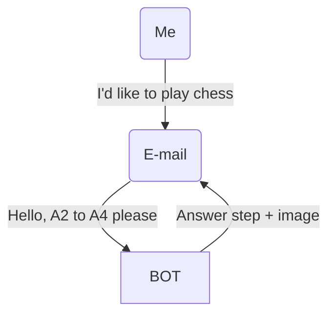

This will (hopefully) be a Java and API practice for me.

My workplace banned chess.com, but not email sites.
My plan is to play chess against bots in e-mail, so as to write the step I want to take, and the answer comes with the step taken by a bot, alongside some visual representation

The thing is, I'm too lazy to code the whole game by myself, so I hope to use an api, or chessbot api for the answers. 

This would be a form of [Correspondence chess](https://en.wikipedia.org/wiki/Correspondence_chess).

Let's hope I won't forget to actually make this.
